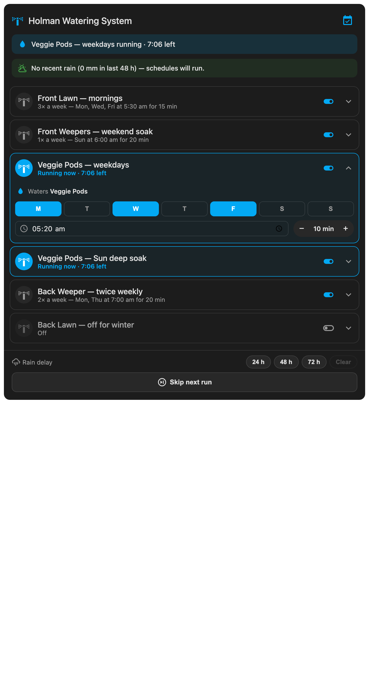
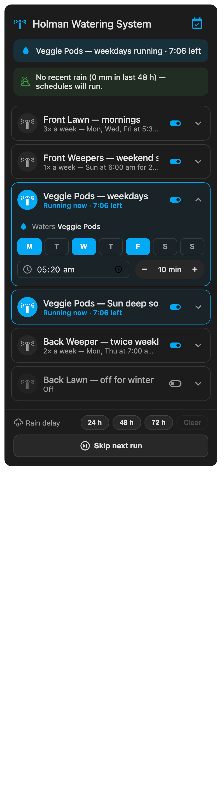

# Irrigation Schedule Card

A Lovelace card for **weekly irrigation scheduling with rain smarts**, built around *schedules*. A schedule is one watering — a name, a zone, the days it runs, a start time and a duration. Add as many as you like, and the **same zone can appear in several schedules**: *"Veggie Pods — Mon/Wed/Fri 10 min"* and *"Veggie Pods — Sun 30 min deep soak"* live side by side. The card keeps a native Home Assistant `schedule` helper per zone in sync from your schedules. All the countdown, skip and stop logic lives **server-side** in Home Assistant — the card is a viewer/editor, so closing the app never breaks a schedule.

It is the companion to [manual-irrigation-zone-card](https://github.com/mycrouch/manual-irrigation-zone-card): the manual card handles ad-hoc runs, this one handles the weekly programme. Both share the same timers and safety automations, so manual and scheduled runs use one reliability model.

<p align="center">
  
  &nbsp;
  
</p>

## Features

- **Schedules are the first-class object.** Each schedule is one watering: a display name, one zone, its days, a start time, a run duration and an enable toggle. The card face lists them with plain-language summaries — *"3× a week — Mon, Wed, Fri at 5:30 am for 10 min"*, *"1× a week — Sun at 7:00 am for 30 min"*, or *"Off"* — and tap-to-expand editing for the days, time and duration. The name is what you read everywhere; "zone" only appears where you pick the physical valve.
- **The same zone, many schedules.** A zone can run a short weekday cycle *and* a long weekend soak — add one schedule for each. If two schedules ever fire for a zone that's already running, the card's server-side dispatcher never double-starts it; it extends the running timer only when the new run would finish later.
- **One native helper per zone, kept in sync.** Behind the scenes each zone keeps exactly one `schedule` helper (`schedule.irrigation_zone_N_schedule`); the card regenerates its weekly blocks as the union of every enabled schedule on that zone, so the dispatcher automation is untouched and each schedule's own duration is honoured. Your schedule definitions live in the card config and are saved back to the Lovelace config, so face edits persist across refreshes.
- **Plain-language rain status.** The rain area reads as a sentence, not raw entities — *"No recent rain (0 mm in last 48 h) — schedules will run"*, *"14 mm in last 48 h — next scheduled runs will be skipped"*, or *"Raining hard (6 mm/h) — active zones stopped"*.
- **Rain-delay and skip controls.** One-tap 24 h / 48 h / 72 h rain delays with a clear button, plus a "Skip next run" button that self-clears after one cycle. A master switch turns the whole programme on or off.
- **Fail-safe by design.** If the rain data is missing or stale, the schedule **runs anyway** and the card says so — watering is never silently skipped.
- **Missing helpers? One-tap Create.** If a configured helper is missing, an admin gets a **Create** button right where the control would be, instead of a bare error. The one-click setup is idempotent — re-running fills gaps and never creates duplicates.
- **Two-step, guided editor.** First define the **zones in your system** (a physical valve/switch each) and click **Set up helpers** to create the timer / schedule / enable helpers, the control helpers, the rainfall utility meter + 48 h template sensor and the dispatcher / rain-stop / safety automations — all server-side, no YAML. Then build your **Schedules** list, each bound to one of those zones. A card-level default duration seeds new schedules; each keeps its own after that. Per-card style option (default / theme / manual gradient).

## How it works

The card never runs a timer in the browser. Setup creates:

1. **A `schedule` helper per zone** (`schedule.irrigation_zone_N_schedule`). Your schedules are the source of truth; the card regenerates each zone's helper as the union of the blocks contributed by every enabled schedule on that zone. Two schedules on one zone become two blocks (with their own times and durations) in that one helper.
2. **A dispatcher automation** — when a zone's schedule block starts, it starts that zone's `timer` (duration = block length, so each schedule's own duration is honoured) and turns the zone switch on, *unless* a skip condition is active (global/zone disabled, skip-next armed, rain delay active, or 48 h rainfall at/above the threshold). If the zone is **already running** (an overlapping schedule), it doesn't double-start — it extends the timer only when the new block ends later than the current finish.
3. **A rain-stop automation** — if the live precipitation rate stays above the rain-stop threshold for 5 minutes while any zone is on, it turns every zone off and cancels the timers.
4. **Shared safety automations** — turn a zone off when its timer ends, and cancel a zone's timer if the zone is switched off elsewhere. These are shared with `manual-irrigation-zone-card`.
5. **A daily rainfall utility meter + a 48 h template sensor** — the utility meter tracks today's rain from your "precipitation today" sensor; the template sensor sums today + yesterday for the rolling 48 h figure used by the skip logic.

## How the rain smarts work

The card watches the weather so it doesn't water a wet garden, using **two independent thresholds** plus a manual delay. You set both thresholds in the editor's **Rain smarts** section, where each field shows its current live reading so you can sanity-check it.

- **Rain-stop rate (mm/h) — "it's raining right now".** A live precipitation-rate sensor. If the rate stays above this threshold for a few minutes while a zone is running, every active zone is turned off and its timer cancelled. This is the *"Raining hard (6 mm/h) — active zones stopped"* case. Default 4 mm/h.
- **48 h skip amount (mm) — "the ground is already wet".** A rolling total of the rain over the last two days. When a scheduled run is due, if this total is at or above the threshold the run is skipped — no point watering soaked ground. This is the *"14 mm in last 48 h — next scheduled runs will be skipped"* case. Default 10 mm.
- **Rain delay — "hold off for a bit".** The 24 h / 48 h / 72 h buttons on the card set a "don't water until" time; scheduled runs are paused until then, and **Clear** cancels it. Shown as *"Rain delay until Thu 6:00 am — scheduled runs paused"*.

**Fail-safe:** the rain checks can only ever *skip* a run — they can never be the reason a run happens. If the weather data is **missing, unavailable or stale** (older than a few hours — common with cloud-sourced sensors), the card does **not** guess. The schedule **runs as normal** and the card shows *"Rain data unavailable or stale — schedules will run anyway (fail-safe)"*. A dry garden is a worse outcome than an occasional unnecessary watering, so when in doubt it waters.

## Installation

### HACS (recommended)

1. HACS → three-dot menu → **Custom repositories**.
2. Add `https://github.com/mycrouch/irrigation-schedule-card` with category **Lovelace**.
3. Install **Irrigation Schedule Card**, then hard-refresh the browser (Cmd/Ctrl + Shift + R).

### Manual

1. Copy `irrigation-schedule-card.js` to `/config/www/`.
2. Add the resource: Settings → Dashboards → three-dot menu → Resources → Add, URL `/local/irrigation-schedule-card.js`, type **JavaScript Module**.

## Configuration

Add the card from the dashboard's card picker ("Irrigation Schedule Card") and use the **GUI editor** — it is the intended way to configure this card. The editor is two steps:

1. **Zones in your system.** Pick your irrigation device (optional — it filters the entity pickers), then add each physical zone and choose its switch/valve entity. Choose your rain sensors under **Rain smarts**. Click **⚙ Set up helpers** (admin required) — the card creates the timer / schedule / enable helper per zone, the control helpers, the rainfall utility meter + 48 h sensor and the automations, and fills the config in for you.
2. **Schedules.** Add a schedule, give it a name, pick which zone it waters, tick its days, set the start time and duration, and enable it. Add another for the same zone if you want a second watering (e.g. a weekend deep soak). You can also edit a schedule's days, time and duration straight on the card face.

### YAML example

```yaml
type: custom:irrigation-schedule-card
title: Holman Watering System
style: default
default_minutes: 15
global_enable: input_boolean.irrigation_schedule_enabled
skip_next: input_boolean.irrigation_skip_next_run
rain_delay: input_datetime.irrigation_rain_delay_until
rain_rate_sensor: sensor.ibrisb3665_precipitation_rate
rain_today_sensor: sensor.ibrisb3665_precipitation_today
rain_48h_sensor: sensor.irrigation_rain_48h
rain_stop_number: input_number.irrigation_rain_stop_rate
skip_48h_number: input_number.irrigation_skip_rain_48h
zones:
  - entity: switch.irrigation_zone_3_veggie_pods
    schedule: schedule.irrigation_zone_3_schedule
    timer: timer.irrigation_zone_3
    enable: input_boolean.irrigation_zone_3_schedule_enabled
    name: Veggie Pods
schedules:
  - id: s1
    name: Veggie Pods — weekdays
    zone: switch.irrigation_zone_3_veggie_pods
    days: [0, 2, 4]        # Mon, Wed, Fri (Monday = 0)
    start: "05:20"
    minutes: 10
    enabled: true
  - id: s2
    name: Veggie Pods — Sun deep soak
    zone: switch.irrigation_zone_3_veggie_pods
    days: [6]              # Sun
    start: "07:00"
    minutes: 30
    enabled: true
```

### Options

| Option | Type | Default | Description |
|---|---|---|---|
| `title` | string | `Irrigation Schedule` | Card title. |
| `style` | string | `default` | `default` (theme-native), `theme` (apply an installed theme to this card), or `manual` (custom gradient). |
| `theme` | string | — | Installed theme name, when `style: theme`. |
| `color_from` / `color_to` | hex | `#0f2f4a` / `#039be5` | Gradient colours, when `style: manual`. |
| `default_minutes` | number | `15` | Seeds the run duration when you add a new schedule. Each schedule keeps its own after that. |
| `device` | string | — | Irrigation device id — filters the zone entity pickers in the editor. |
| `global_enable` | entity | — | `input_boolean` master switch for the whole schedule. |
| `skip_next` | entity | — | `input_boolean` that skips the next scheduled run (self-clears). |
| `rain_delay` | entity | — | `input_datetime` holding the "delay until" time. |
| `rain_rate_sensor` | entity | — | Live precipitation-rate sensor (mm/h) used for rain-stop. |
| `rain_today_sensor` | entity | — | Precipitation-today sensor (mm) — source for the utility meter. |
| `rain_48h_sensor` | entity | — | 48 h rainfall sensor (mm) used for the skip check. |
| `rain_stop_number` | entity | — | `input_number` rain-stop threshold (mm/h, default 4). |
| `skip_48h_number` | entity | — | `input_number` 48 h skip threshold (mm, default 10). |
| `zones[]` | list | `[]` | Up to 8 physical zones (see below). |
| `schedules[]` | list | `[]` | Your schedules (see below). If omitted, one schedule per zone is derived on load from that zone's existing helper blocks. |

Per zone:

| Option | Type | Default | Description |
|---|---|---|---|
| `entity` | entity | — | Zone switch / valve (required). |
| `name` | string | friendly name | Display name for the zone in the schedule pickers. |
| `icon` | string | `mdi:sprinkler-variant` | Zone icon. |
| `schedule` | entity | — | The zone's `schedule` helper. |
| `timer` | entity | — | The zone's `timer` helper. |
| `enable` | entity | — | `input_boolean` enabling this zone's schedule (per-zone master, retained for back-compat). |

Per schedule:

| Option | Type | Default | Description |
|---|---|---|---|
| `id` | string | auto | Stable identifier (generated if omitted). |
| `name` | string | — | Display name — what you read on the card face. |
| `zone` | entity | first zone | The zone entity this schedule waters (must be one of `zones[]`). |
| `days` | list | `[]` | Day indices, Monday = 0 … Sunday = 6. |
| `start` | string | `05:00` | Start time (`HH:MM`). |
| `minutes` | number | `default_minutes` | Run duration in minutes. |
| `enabled` | boolean | `true` | Whether this schedule is active. |

### Upgrading from v0.2

v0.2 configs (zones with per-zone `schedule` / `timer` / `enable`, no `schedules`) keep working. On load, the card derives one schedule per zone from that zone's existing helper blocks, so no watering plan is lost. Open the editor to name and split those into as many schedules as you like.

## Notes & caveats

- **Admin required** for one-click setup — it creates helpers and automations through Home Assistant's config API.
- Schedule blocks do not cross midnight; a run that would spill past 23:59 is clamped.
- The rain sensors are only as reliable as their source. If yours is cloud-sourced (e.g. Weather Underground) it can go stale — that is exactly why this card fails safe and keeps watering, with a warning, when the data is missing.

## Related projects

| Project | What it does |
|---|---|
| [manual-irrigation-zone-card](https://github.com/mycrouch/manual-irrigation-zone-card) | Companion card for ad-hoc zone runs — together or in sequence, with live countdowns. |
| [airtouch-card](https://github.com/mycrouch/airtouch-card) | Console-style AirTouch 4/5 climate card. |
| [gradient-themes](https://github.com/mycrouch/gradient-themes) | 40 gradient dashboard themes sharing this card's palette. |
| [ecovacs-vacuum-card](https://github.com/mycrouch/ecovacs-vacuum-card) | Ecovacs robot vacuum card with a per-card theme picker. |

## License

MIT © Jason Crouch. Icons are [Material Design Icons](https://pictogrammers.com/library/mdi/) (Apache 2.0).
